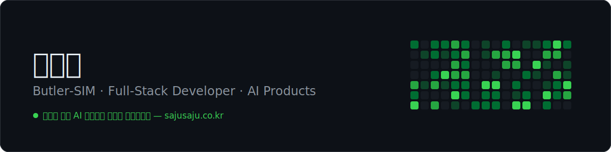

Java · Python · TypeScript 기반 8년차 풀스택 개발자.
결제가 붙은 AI 분석 서비스를 혼자 만들어 운영하고 있어요.

  
  

**now**

- [사주사주](https://sajusaju.co.kr) — LLM 프로바이더 4개(OpenAI · Gemini · Claude · Grok)를 통합한 AI 명리 분석 서비스. 기획부터 결제, 프롬프트 운영, 장애 복구까지 혼자 굴려요. 오늘도 돌아가요.
- SK AX — Agentic AI 기반 SDLC 자동화 플랫폼 davis의 API Test 에이전트 백엔드를 단독 개발. aTworks 테스트 플랫폼 3.0 전환도.

**before**

국방부 보안 시스템 3종, 동원몰, 현대문학, IQOS 렌탈 — 공공과 커머스, 엔터프라이즈를 오가며 결제 · 구독 · 관리자 시스템을 만들었어요.

**stack**

  
  
  
  
  
  

**elsewhere**

[portfolio](https://simwanwoo.vercel.app) · [celis.co.kr](https://celis.co.kr) · sww4689@naver.com
