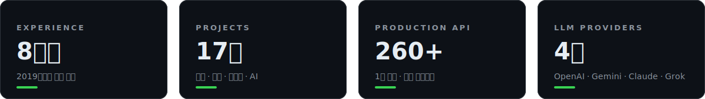

Java · Python · TypeScript 풀스택 개발자. 결제가 붙은 AI 분석 서비스를 혼자 만들어 운영하고 있어요.

**featured**

**before**

국방부 보안 시스템 3종, 동원몰, 현대문학, IQOS 렌탈 — 공공과 커머스, 엔터프라이즈를 오가며 결제 · 구독 · 관리자 시스템을 만들었어요.

**stack**

`backend`&nbsp;

`frontend`&nbsp;

`ai · infra`&nbsp;

**elsewhere**

[portfolio](https://simwanwoo.vercel.app) · [celis.co.kr](https://celis.co.kr) · sww4689@naver.com
