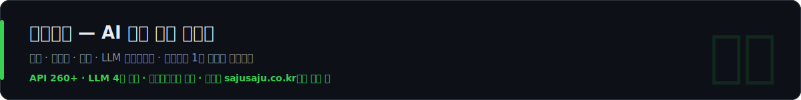
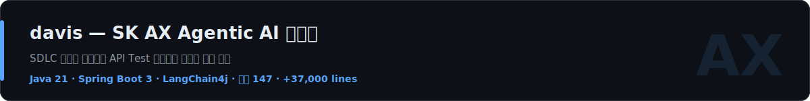

**about**

국방부 보안 시스템에서 시작해 동원몰 같은 대형 커머스, 스타트업 초기 제품, 지금은 SK AX의 Agentic AI 플랫폼까지 — 가장 보수적인 현장과 가장 앞선 현장을 오가며 서비스를 만들어 온 풀스택 개발자예요. 주력은 Java · Python · TypeScript고, 백엔드와 프론트를 한 흐름으로 다뤄요.

제 기준은 하나예요. 화면을 만드는 게 아니라, 결제가 붙고 장애가 복구되고 운영자가 쓸 수 있는 상태까지 가야 개발이 끝난다는 것. 그 기준으로 AI 명리 분석 서비스 [사주사주](https://sajusaju.co.kr)를 기획부터 디자인, 결제, LLM 파이프라인, 운영까지 혼자 만들었어요. 오늘도 돌아가고 있어요.

AI 기능을 붙여 본 개발자는 많지만, LLM의 비용과 실패와 품질까지 운영해 본 개발자는 아직 드물어요. 저는 후자예요.

**featured**

**how i work**

- 계산과 해석을 분리해요 — 사주 계산은 순수 결정론 엔진으로, LLM은 해석에만. 모델을 갈아끼워도 결과가 흔들리지 않아요.
- 프롬프트는 배포 없이 운영해요 — 모델 라우팅, 톤 정책, A/B 실험을 관리자 콘솔에서 바꿔요. LLM 호출마다 토큰·지연·비용을 기록하고요.
- 실패를 전제로 설계해요 — 이중 과금은 DB 유니크 인덱스로 막고, 큐에 갇힌 잡은 스위퍼가 감지해서 크레딧 환불까지 자동 복구해요.
- 폐쇄망도 다뤄 봤어요 — 정적 빌드 한 벌을 런타임 설정 주입으로 전 환경에서 재사용하는 구조를 SK AX 금융권 플랫폼에서 설계했어요.

**before**

국방부 보안 시스템 3종, 동원몰, 현대문학, IQOS 렌탈 — 공공과 커머스, 엔터프라이즈를 오가며 결제 · 구독 · 관리자 시스템을 만들었어요.

**stack**

`backend`&nbsp;

`frontend`&nbsp;

`ai · infra`&nbsp;

**elsewhere**

[portfolio](https://simwanwoo.vercel.app) · [celis.co.kr](https://celis.co.kr) · sww4689@naver.com
